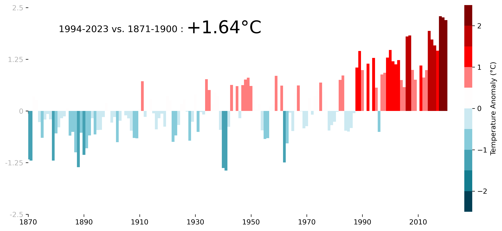

# Country Temperature Anomaly Visualizer



This Python script visualizes the temperature anomalies of various countries over time, comparing historical data with recent trends. It uses data from the Berkeley Earth temperature dataset, plotting both positive and negative temperature anomalies to highlight changes in the climate.

## Features

- Downloads temperature data directly from Berkeley Earth.
- Calculates annual temperature anomalies for each country.
- Generates a custom color map to visually distinguish between positive and negative anomalies.
- Creates a dual-axis bar plot to separately visualize positive and negative temperature anomalies.
- Calculates and displays the temperature anomaly difference between the periods 1995-2024 and 1871-1900.
- Saves the plots and a separate colorbar as images, then merges them for a comprehensive visualization.

## Prerequisites

Before running this script, ensure you have the following Python packages installed:

- pandas
- matplotlib
- numpy
- Pillow
- requests

You can install these packages using pip:

```bash
pip install pandas matplotlib numpy Pillow requests
```
## Usage

To visualize the temperature anomalies for a specific country, run the script with the desired country name as shown below:

```python
plot_country_temperature_anomalies('Country Name')
```
Replace 'Country Name' with the name of the country you want to analyze. For example:
```python
plot_country_temperature_anomalies('Germany')
```
This will generate an image file named combined_figure_Country Name.png in your current working directory.

## Customizing the Visualization

The script includes a function to create a custom colormap for the visualization. You can modify the negative_colors_hex list within the create_custom_colormap function to change the color scheme for negative temperature anomalies.

## Data Source

The temperature data used in this visualization is sourced from Berkeley Earth and is subject to their terms and usage policies. Please ensure compliance with their data usage guidelines.

## License
This project is open-source and available under the MIT License. See the LICENSE file for more details.


